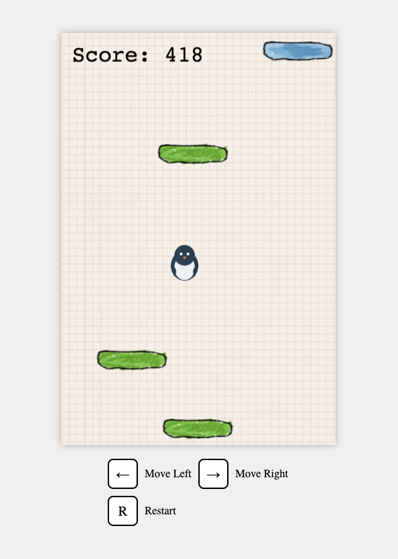

# Penguin Jump

A Doodle Jump style game featuring a cute jumping penguin, built with Phaser 3 and TypeScript.



## Game Features

- Endless vertical jumping gameplay
- Three types of platforms:
  - Regular platforms: Safe to jump on
  - Disappearing platforms: Vanish after use
  - Destructive platforms: Break immediately
- Score system based on height achieved
- Special rocket boost power-up (unlocked via ShieldLayer mint)
- Background music and sound effects

## Controls

- Left Arrow / Right Arrow: Move penguin left/right
- R: Restart game

## Development

This game is built with:
- Phaser 3.87.0
- TypeScript 5.4.5
- Vite 5.3.1

### Getting Started

1. Clone the repository
```bash
git clone https://github.com/yourusername/penguin-jump
```

2. Install dependencies
```bash
npm install
```

3. Start development server
```bash
npm run dev
```

4. Build for production
```bash
npm run build
```

## Credits

- Game Engine: [Phaser 3](https://phaser.io)
- Inspired by: [Doodle Jump](https://en.wikipedia.org/wiki/Doodle_Jump)
- Sound Effects: [zapsplat](https://www.zapsplat.com/)
- Background Music: [chinaz](https://sc.chinaz.com/tag_yinxiao/chaojimali.html)

## License

[MIT License](LICENSE)
